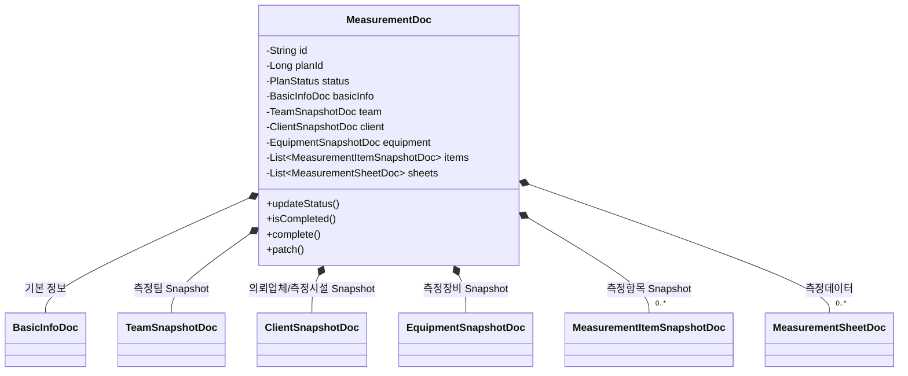

# Measurement Domain Class Diagram

```mermaid
classDiagram
    MeasurementDoc *-- BasicInfoDoc : 기본 정보
    MeasurementDoc *-- TeamSnapshotDoc : 측정팀 Snapshot
    MeasurementDoc *-- ClientSnapshotDoc : 의뢰업체/측정시설 Snapshot
    MeasurementDoc *-- EquipmentSnapshotDoc : 측정장비 Snapshot
    MeasurementDoc *-- "0..*" MeasurementItemSnapshotDoc : 측정항목 Snapshot
    MeasurementDoc *-- "0..*" MeasurementSheetDoc : 측정데이터
    
    class MeasurementDoc {
        -String id
        -Long planId
        -PlanStatus status
        
        -BasicInfoDoc basicInfo
        
        -TeamSnapshotDoc team
        -ClientSnapshotDoc client
        -EquipmentSnapshotDoc equipment
        
        -List~MeasurementItemSnapshotDoc~ items
        -List~MeasurementSheetDoc~ sheets

        +updateStatus()
        +isCompleted()
        +complete()
        +patch()
    }
    
    class BasicInfoDoc
    
    class TeamSnapshotDoc
    class ClientSnapshotDoc
    class EquipmentSnapshotDoc
    class MeasurementItemSnapshotDoc
    class MeasurementSheetDoc
```