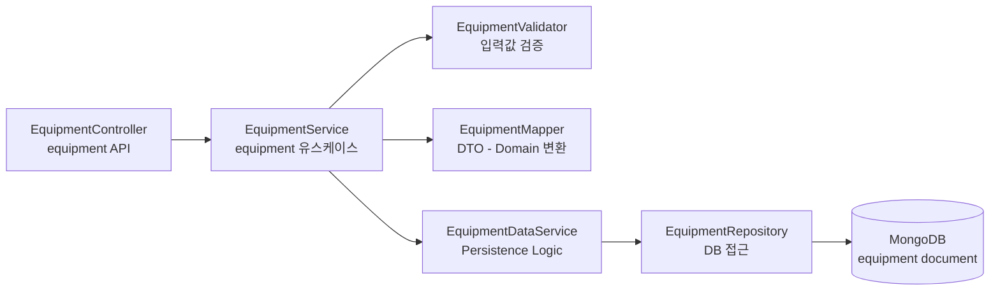

# Equipment Component Diagram

## 1. Equipment Overview
Equipment Context는 측정 및 실험 장비 원장 데이터를 관리하는 Context이다.

기본적인 Component 구조는 master-data-components.md 와 유사하나,
장비 교정 정보, 사용 이력, snapshot 제공 등의 특성을 가진다.

Equipment 정보는 Measurement / Lab Context에서
측정 당시 장비 snapshot 형태로 사용된다.

DB 저장소는 MongoDB 기반으로 관리된다.