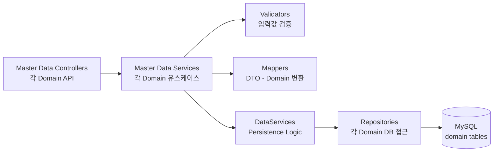

# Master Data Component Diagram

## 1. Master Data Overview
Master Data Context는 업체(Company), 사업장(Workplace), 배출구(Stack) 등
측정 업무의 기준 정보를 관리하는 Context이다.

각 Domain은 개별적으로 분리되어 있으나, 대부분 동일한 CRUD 중심 구조를 가지므로
공통적인 Component 구조 패턴으로 표현한다.

## 2. Include Domains
- Company
- Workplace
- Stack
- StackMeasurement
- Prevention
- Pollutant
- Team
- Plan

## 2. Component Responsibilities
### Master Data Controllers
- 각 Domain 관련 API 요청을 처리한다.
- Request DTO를 입력받고 Response DTO를 반환한다.
- 비즈니스 로직은 직접 수행하지 않는다.

### Master Data Services
- 각 Domain의 유스케이스 흐름을 제어한다.
- 검증, 변환, 저장 로직을 조합한다.

### Validators
- 입력값을 검증한다.
- 중복 여부, 필수값, 포맷 등을 검증한다.

### Mappers
- Request/Response DTO와 Domain 객체 간 변환을 담당한다.
- 외부 API 구조와 내부 Domain 모델을 분리한다.

### DataServices
- Persistence 관련 흐름을 담당한다.
- Repository 호출 및 저장/조회 조합 로직을 처리한다.

### Repositories
- 각 Domain의 DB 접근을 담당한다.
- MySQL 테이블과 직접 통신한다.

## 3. Notes
- 각 Domain은 Master Data Context 내부에서 독립으로 관리된다.
- Master Data는 측정 계획 및 성적서 생성 시 참조 데이터로 사용된다.
- Equipment Domain은 Snapshot 및 이력 관리 특성이 존재하므로 별도의 Context로 분리한다.
- Measurement, LabAnalysis Domain은 MongoDB 기반 측정 기록 및 계산 특성이 존재하므로 별도의 Context로 분리한다.