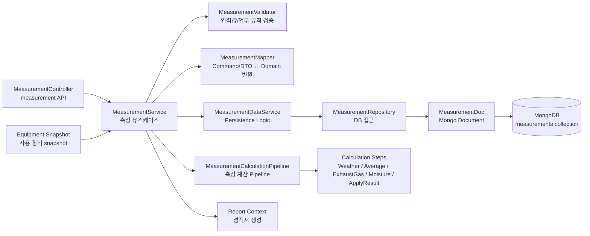

# Measurement Component Diagram

## 1. Measurement Overview
Measurement Context는 측정 계획을 기반으로 현장 측정 기록을 생성하고, 측정값 입력/계산/저장을 담당하는 Context이다.

측정 데이터는 중첩 구조가 많고 항목별 입력값이 유동적이므로 MongoDB Document로 관리한다.

## 2. Component Responsibilities

### MeasurementController
- 측정 기록 생성, 조회, 임시저장, 제출 등의 API 요청을 처리한다.
- Request DTO를 입력받고 Response DTO를 반환한다.
- 계산 및 저장 로직은 직접 수행하지 않는다.
- 
### MeasurementService
- 측정 관련 유스케이스 흐름을 제어한다.
- 검증, 장비 snapshot 적용, DTO 변환, 계산 Pipeline 실행, 저장 흐름을 조합한다.

### MeasurementValidator
- 측정 입력값 및 업무 규칙을 검증한다.
- 측정일, 측정항목, 측정 시트, 필수 입력값 등을 검증한다.
   
### MeasurementMapper
- Command/DTO와 Measurement Domain 또는 MeasurementDoc 간 변환을 담당한다.
- API 입력 구조와 내부 저장/계산 모델을 분리한다.

### MeasurementCalculationPipeline
- 측정값 계산 흐름을 담당한다.
- 각 Step은 독립적인 계산 책임을 가진다.

### Calculation Steps
- WeatherStep: 기압 등 기상 데이터 변환
- AverageStep: 측정점 평균값 계산
- ExhaustGasStep: 배출가스 조성 및 밀도 계산
- MoistureStep: 수분량 계산
- ApplyResultStep: 계산 결과를 측정 문서에 반영

### MeasurementDataService
- MongoDB 저장/조회 흐름을 담당한다.
- Repository 호출 및 저장/조회 조합 로직을 처리한다.

### MeasurementRepository
- measurements collection에 접근한다.

## Notes
- Measurement Context는 Plan Context에서 생성된 측정 계획을 기반으로 측정 기록을 생성한다.
- Equipment Context의 장비 정보는 원본 Entity를 공유하지 않고, 측정 당시 snapshot으로 복사하여 사용한다.
- MeasurementCalculationPipeline은 MongoDB, HTTP, Excel 같은 외부 기술에 의존하지 않는 계산 흐름을 지향한다.
- Report Context는 Measurement Context의 계산 결과를 받아 성적서를 생성한다.