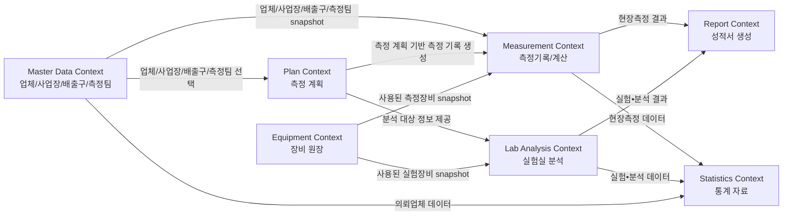

# Context Map

## 1. Context Overview

### Master Data Context
- 업체, 사업장, 배출구 등 의뢰업체 정보를 관리한다. 
- 측정 계획 작성, 성적서 및 통계 자료 생성 시 참조된다.
- Measurement Context에는 <b>원본 Entity가 아닌 snapshot 형태</b>로 전달된다.

### Equipment Context
- 측정/실험 장비 원장 데이터를 관리한다.
- Measurement / Lab Context에는 <b>원본 Entity가 아닌 snapshot 형태</b>로 전달된다.

### Plan Context
- Master Data, Team Context 데이터를 조회하여 측정 계획을 생성한다.

### Measurement Context
- 현장 측정 기록 및 계산을 담당한다.
- 기상정보, 배출가스, 수분량, 등속흡입계수 등의 계산 로직이 포함된다.

### Lab Analysis Context
- 시료 분석 및 실험실 분석 결과를 관리한다.
- 분석 결과는 성적서 생성 및 통계 자료에 사용된다.

### Report Context
- Measurement / Lab Context의 결과를 조합하여 성적서를 생성한다.
- Report Context는 계산 로직보다는 출력/표현 책임을 가진다.

### Statistics Context
- Measurement / Lab Context의 데이터를 가공하여 통계 자료를 생성한다.

## 2. Context Relationships

### Master Data -> Measurement
- 마스터 데이터 원본 Entity를 직접 공유하지 않는다.
- 측정 당시 필요한 정보만 snapshot 형태로 복사하여 사용한다.

### Equipment → Measurement
- 장비 원본 Entity를 직접 공유하지 않는다.
- 측정 당시 필요한 정보만 snapshot 형태로 복사하여 사용한다.
- 과거 측정 기록이 장비 원장 변경에 영향을 받지 않도록 한다.