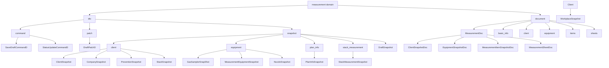

```mermaid
flowchart TB
    measurement[measurement domain]

    measurement --> dto[dto]
    dto --> command[command]
    dto --> patch[patch]
    dto --> snapshot[snapshot]
    snapshot --> client[client]
    snapshot --> equipment[equipment]
    snapshot --> plan_info[plan_info]
    snapshot --> stack_measurement[stack_measurement]

    measurement --> document[document]
    document --> MeasurementDoc
    document --> basicInfoDoc[basic_info]
    document --> clientDoc[client]
    document --> equipmentDoc[equipment]
    document --> itemDoc[items]
    document --> sheetDoc[sheets]

    command --> SaveDraftCommandD
    command --> StatusUpdateCommandD
    patch --> DraftPatchD
    snapshot --> DraftSnapshot
    client --> ClientSnapshot
    client --> CompanySnapshot
    client --> PreventionSnapshot
    client --> StackSnapshot
    Client --> WorkplaceSnapshot
    equipment --> GasSamplerSnapShot
    equipment --> MeasurementEquipmentSnapshot
    equipment --> NozzleSnapshot
    plan_info --> PlanInfoSnapshot
    stack_measurement --> StackMeasurementSnapshot   

    MeasurementDoc --> ClientSnapshotDoc
    MeasurementDoc --> EquipmentSnapshotDoc
    MeasurementDoc --> MeasurementItemSnapshotDoc
    MeasurementDoc --> MeasurementSheetDoc
```