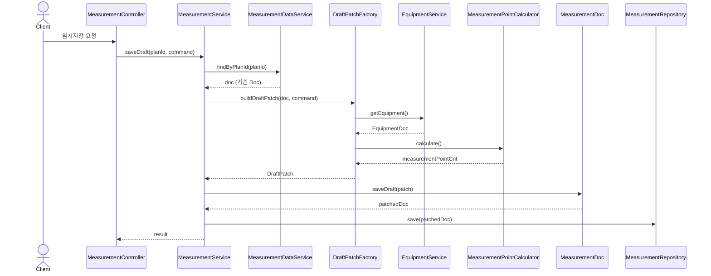

```mermaid
    sequenceDiagram
        actor Client

        Client ->> MeasurementController: 임시저장 요청
        MeasurementController->>MeasurementService: saveDraft(planId, command)
    
        MeasurementService->>MeasurementDataService: findByPlanId(planId)
        MeasurementDataService-->>MeasurementService: doc (기존 Doc)
    
        MeasurementService->>DraftPatchFactory: buildDraftPatch(doc, command)
    
        DraftPatchFactory->>EquipmentService: getEquipment()
        EquipmentService-->>DraftPatchFactory: EquipmentDoc
    
        DraftPatchFactory->>MeasurementPointCalculator: calculate()
        MeasurementPointCalculator-->>DraftPatchFactory: measurementPointCnt
    
        DraftPatchFactory-->>MeasurementService: DraftPatch
    
        MeasurementService->>MeasurementDoc: saveDraft(patch)
        MeasurementDoc-->>MeasurementService: patchedDoc
    
        MeasurementService->>MeasurementRepository: save(patchedDoc)
    
        MeasurementService-->>MeasurementController: result
```